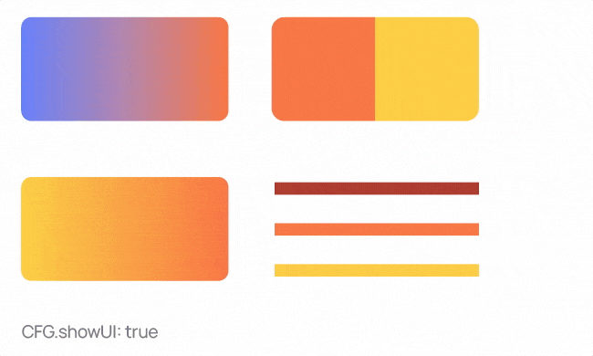

## AverageColors

Averages the colors of selected objects or separately inside groups or gradients. The script skips objects without color or with a pattern. If nothing is selected, the script process all groups in the document. It has two modes: silent and dialog. Changing in `CFG.showUI`.   

Modes change without editing the code if you hold down the <kbd>Alt</kbd> key when running the script:

* <kbd>Alt</kbd> + `CFG.showUI: false` the dialog will be shown
* <kbd>Alt</kbd> + `CFG.showUI: true` silent mode with the latest options

 