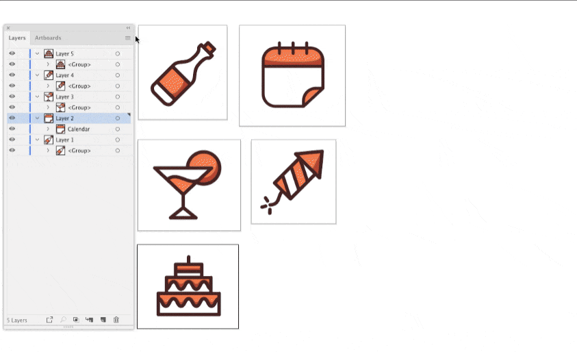

## BatchRenamer

Batch renames Artboards, top-level Layers and selected objects in the document. Adds a common prefix and suffix to names. "Find & Replace" replaces matching strings in current names.

**Placeholders** 

* {w} - the width of the artboard or selected object in units of the document
* {h} - the height of the artboard or selected object
* {u} - document units (Document Setup > Units) 
* {nu:0} - ascending auto-numbering from the entered value
* {nd:0} - descending auto-numbering from the entered value
* {c} - document color model (RGB or CMYK)
* {d} - current date (YYYYMMDD)
* {n} - the current name to be replaced in "Find & Replace"

> **Note**   
> If you want to change the number of rows, change the CFG `rows: 5` in the script file and the same value in `listHeight: 5 * 32`. In `precision: 0` sets the number of decimal places for height and width of artboards and objects.

